# 🚗⚡ Tesla → Phone Hotspot Auto-Toggle

### Ditch Tesla's Premium Connectivity. Your phone already does the job — for free.

[](#)
[](#)
[](#)
[](#)

Get in the car. Bluetooth connects. By the time you've buckled up, your phone has
**silently woken itself, unlocked past its own PIN, flipped on its mobile hotspot,
and gone back to sleep** — no subscription, no extra hardware puck, no root, no
PC. Just Home Assistant reaching through a notification and puppeteering your phone
like a marionette.

Walk away, and it undoes itself just as quietly.

## Why this is great

- **Skips Tesla's Premium Connectivity / Connectivity Kit entirely.** The car gets
  internet (maps, streaming, software updates) over your phone's hotspot instead of
  Tesla's paid LTE subscription or the extra WiFi hardware puck — free, and it's
  bandwidth you already pay for anyway.
- Fully automatic: hotspot turns on the moment the phone connects to the car over
  Bluetooth, and back off when you walk away. Zero manual interaction, works even if
  the phone is locked and asleep in your pocket.
- No root, no jailbreak, no persistent background app drain — just a one-time Shizuku
  pairing.

**One extra setting you need on the phone**: normal Android aggressively turns WiFi
off to save battery when the screen is off. Make sure "Keep WiFi on during sleep" /
"Stay connected to WiFi" (exact wording varies by Android skin, usually under
Settings → WiFi → advanced, or Settings → Battery) is enabled — otherwise Android
switches WiFi off mid-drive even though the hotspot radio itself stays up, and the
car drops the connection.

## Why is this so complicated? (short version)

Since Android 10 (API 29), no third-party app — not even root-less `adb shell` — is
allowed to toggle the hotspot directly via API (`cmd wifi start-softap` throws
`SecurityException` even for UID 2000/shell). The only remaining options without
root:

1. Tap the real Quick Settings tile (simulate a user tap).
2. Root.

Simulating the tap via Tasker/AutoInput (Android AccessibilityService) fails on the
**secure lockscreen** — Android deliberately blocks AccessibilityService gestures
there (anti-malware protection against apps unlocking themselves). `adb shell input`
still works there, because it's a separate, privileged debug channel (not
AccessibilityService-based).

**Shizuku** grants exactly that adb-shell privilege (UID 2000) to the phone
permanently, without a PC — one-time pairing via "Wireless debugging" in Developer
Options. Termux (as the executor Tasker calls into) uses Shizuku via `rish`
(Shizuku's own shell wrapper binary) to run `input tap`/`input text` with shell
privileges — even on the locked lockscreen.

## Architecture

```mermaid
flowchart LR
    A[Tesla connects<br/>via Bluetooth] --> B[Home Assistant<br/>automation]
    B -->|notify service<br/>command_broadcast_intent| C[FCM push]
    C --> D[HA app<br/>on the phone]
    D -->|sendBroadcast| E[Tasker profile<br/>Intent Received]
    E --> F[Termux:Tasker<br/>plugin action]
    F --> G[rish / Shizuku<br/>shell UID 2000]
    G --> H[input tap/swipe/text<br/>unlock + tile tap]
    H --> I[Hotspot toggled]
```



## Prerequisites (one-time setup)

1. **Shizuku** (Play Store is fine).
   - Developer options → Wireless debugging: on.
   - Shizuku app → "Start via wireless debugging" → pairing code flow.
   - After every reboot the service needs a manual restart (no root = no
     auto-start on boot) — open the Shizuku app, tap "Start".

2. **Termux — F-Droid ONLY**, not Play Store!
   - The Play Store build of Termux (`googleplay.*` version) does **not** declare
     `com.termux.permission.RUN_COMMAND` in its manifest — Termux:Tasker can never
     work with it, no matter what permissions you grant.
   - F-Droid: https://f-droid.org/packages/com.termux/

3. **Termux:Tasker** — same source as Termux (F-Droid):
   https://f-droid.org/packages/com.termux.tasker/

4. **Tasker needs the permission** `com.termux.permission.RUN_COMMAND` explicitly:
   - Settings → Apps → Tasker → Permissions → enable "Run commands in Termux
     environment".
   - Without it: error "plugin error: missing, disabled, not exported or no
     permission receiver, or too many receivers" when picking the Termux:Tasker
     action in Tasker.
   - After granting: force-stop both Tasker and Termux:Tasker (the plugin list is
     only rescanned on app start).

5. **Termux storage permission** (needed for `~/.termux/tasker/` file picker,
   backups, etc.):
   - "All files access" alone was **not enough** on this Android build (Samsung
     quirk, not standard AOSP behavior). Also needed:
     `pm grant com.termux android.permission.READ_EXTERNAL_STORAGE` and
     `WRITE_EXTERNAL_STORAGE` — even with "All files access" already on.
   - After any storage permission grant: force-stop Termux completely (not just
     minimize!) and reopen, otherwise it doesn't take effect.
   - Run `termux-setup-storage` once.

6. Set up **rish** (Shizuku shell binary) in Termux:
   ```
   curl -fsSL tinyurl.com/rish3266 | sh
   ```
   (The installer asks for a source — pick "Offline / Extract app" to pull it
   straight from the installed Shizuku app, no download needed.)

   **Known gotcha**: the rish file ships with a placeholder
   `RISH_APPLICATION_ID="PKG"` that the official installer replaces with the real
   package name automatically. If you extract it manually (e.g. straight from the
   Shizuku APK), the placeholder stays and you get "RISH_APPLICATION_ID is not
   set". Fix: export it explicitly before every `rish` call:
   ```
   export RISH_APPLICATION_ID=com.termux
   ```
   (already baked into the provided script).

7. On the first `rish` call, Shizuku asks "Allow Termux to access Shizuku?" → tap
   "Allow all the time".

## Install the script

Easiest way — straight from Termux, no Downloads-folder detour, no storage
permission needed at all (the file goes directly into Termux's own private storage):

```
mkdir -p ~/.termux/tasker
curl -o ~/.termux/tasker/hotspot_toggle.sh https://raw.githubusercontent.com/Infraviored/tesla-hotspot-toggle/main/hotspot_toggle.sh
chmod +x ~/.termux/tasker/hotspot_toggle.sh
```

(Alternative: clone this repo — `git clone` works the same way in Termux — or
`cp` the file over manually if you already have it on the device.)

## Fast path: doing the grants via `adb` instead of the Settings UI

Every permission in the Prerequisites section above can be granted by hand in
Settings. If you have `adb` set up (USB debugging on, phone connected to a PC —
only needed once, for setup), these one-liners are faster:

```bash
adb shell pm grant net.dinglisch.android.taskerm com.termux.permission.RUN_COMMAND
adb shell pm grant com.termux android.permission.READ_EXTERNAL_STORAGE
adb shell pm grant com.termux android.permission.WRITE_EXTERNAL_STORAGE
adb shell appops set com.termux MANAGE_EXTERNAL_STORAGE allow
adb shell am force-stop net.dinglisch.android.taskerm
adb shell am force-stop com.termux.tasker
adb shell am force-stop com.termux
```
Force-stopping afterward is required either way (UI or adb) — permission changes
don't apply to an already-running process.

Create your local PIN file (never commit this):
```
echo -n "YOUR_PIN" > ~/.termux/tasker/hotspot_pin.txt
```
No trailing newline (`echo -n`), otherwise the script types one extra Enter.

**Important if you rewrite the script yourself via a terminal heredoc**: always use
`<< 'EOF'` (quoted!) instead of `<< EOF`. Unquoted heredocs expand `$VARIABLES`
immediately at write time — `$WAS_AWAKE` (meant to be evaluated at script runtime)
silently becomes empty otherwise, breaking conditionals with no visible error.

## Calibrate coordinates (device/layout specific!)

The tap/swipe coordinates in the script (`720 2500`, `1056 507`, etc.) are for a
Samsung Galaxy S24 Ultra (1440×3120, default Quick Settings layout, hotspot as the
5th tile in the first row). On a different device/layout, re-derive them:

1. `adb shell wm size` — check resolution.
2. Screenshot the expanded notification shade (`adb shell input swipe 720 50 720
   1200 300` then `adb shell screencap`), read off the hotspot tile position.
3. If the lockscreen PIN pad layout differs: adjust the swipe start/end for
   `input swipe 720 2500 720 800 150` (swipe away the lockscreen photo → reveal PIN
   pad).

## Tasker setup

1. Create a task (e.g. `HotspotToggle`), one action:
   `+` → Plugin → **Termux:Tasker** → Executable: `hotspot_toggle.sh` (autocomplete
   shows it once the file is in the right folder).
2. Profile: Event → System → **Intent Received** → Action:
   `com.example.HOTSPOT_TOGGLE` → linked to the task above.
3. Test without HA (fire the broadcast manually from a PC via adb, or from the
   phone itself via a second Tasker task with "Send Intent"):
   ```
   adb shell am broadcast -a com.example.HOTSPOT_TOGGLE
   ```

## Home Assistant side

### 1. The service call (what actually went out, verified working)

```bash
curl -X POST \
  -H "Authorization: Bearer $HASS_TOKEN" \
  -H "Content-Type: application/json" \
  -d '{
        "message": "command_broadcast_intent",
        "data": {
          "intent_action": "com.example.HOTSPOT_TOGGLE",
          "intent_package_name": "net.dinglisch.android.taskerm"
        }
      }' \
  "http://homeassistant:8123/api/services/notify/mobile_app_s24_ultra"
```

As a YAML action inside an automation:

```yaml
action:
  - service: notify.mobile_app_s24_ultra
    data:
      message: command_broadcast_intent
      data:
        intent_action: "com.example.HOTSPOT_TOGGLE"
        intent_package_name: "net.dinglisch.android.taskerm"
```

### 2. Why this exact service name and not `notify.my_phone`

The phone's Companion App friendly name is "My Phone", but the **service slug
stays the one it was originally registered under** — here `mobile_app_s24_ultra`
(from the initial pairing as "S24 Ultra"). Renaming in the app only changes
`friendly_name`, not the slug. So it's the **same physical device**, just two
different "names" in the system.

The real difference isn't the name though, it's the **API generation**:
- `notify.my_phone` / `notify.send_message` → the **new**, entity-based notify
  platform (since the 2026 migration). Its service schema only has `message` +
  `title` — **no `data` field anymore**. Sending `data` anyway gets you a `400 Bad
  Request` from HA (extra keys not allowed). This is exactly the open bug
  [home-assistant/core#181441](https://github.com/home-assistant/core/issues/181441).
- `notify.mobile_app_s24_ultra` → the **old, legacy domain service** (pre-migration),
  which stays registered separately per `mobile_app` config entry. Its schema still
  has a generic `data` object (`selector: {object: null}`) with no strict
  validation — so it happily accepts `intent_action`/`intent_package_name`.

Both services ultimately point at the **same push registration** of the same phone —
only the legacy path still lets the extra payload through.

### 3. What happens on the phone once the call arrives

1. HA sends the call to Google's **FCM (Firebase Cloud Messaging)** relay (HA's own
   push proxy in between, same as any Companion App notification).
2. FCM delivers the payload to the Home Assistant app on the phone.
3. The app recognizes `message: "command_broadcast_intent"` as a **reserved command
   string** (no visible notification popup!) and reads `intent_action`/
   `intent_package_name` from `data`.
4. It builds an Android `Intent` with `setAction("com.example.HOTSPOT_TOGGLE")` and
   `setPackage("net.dinglisch.android.taskerm")` and calls `sendBroadcast()` —
   sending the signal **specifically to Tasker only**, not system-wide.
5. **Tasker** must have an "Intent Received" profile configured with exactly that
   action (`com.example.HOTSPOT_TOGGLE`); it fires a task that toggles the hotspot
   (via the flow documented in this README — Termux:Tasker → rish → input taps).
6. The Companion App's own `binary_sensor.my_phone_hotspot_state` picks up the
   changed system state on its own (not instant) update cycle — hence the ~15–20s
   delay observed before the sensor caught up in HA.

### 4. Full chain

```
HA automation
  → notify.mobile_app_s24_ultra (legacy service, data field works)
  → FCM push
  → HA app on the phone (recognizes command_broadcast_intent)
  → sendBroadcast(action=com.example.HOTSPOT_TOGGLE, package=Tasker)
  → Tasker profile matches → Tasker task toggles hotspot
  → binary_sensor.my_phone_hotspot_state updates (delayed, ~15–20s)
```

### 5. Automations

**Trigger** (Bluetooth sensor):
```yaml
trigger:
  - platform: state
    entity_id: sensor.my_phone_bluetooth_connection
```

**Condition** (idempotency — uses the hotspot sensor to avoid double-toggling):
```yaml
condition:
  - condition: template
    value_template: >
      {{ 'Tesla Model 3 Model 3' in state_attr('sensor.my_phone_bluetooth_connection','connected_paired_devices')|string }}
  - condition: state
    entity_id: binary_sensor.my_phone_hotspot_state
    state: "off"
```

**Action:** see section 1 above (`notify.mobile_app_s24_ultra`,
`command_broadcast_intent`).

Mirror a second automation for disconnect: trigger on Tesla BT disconnected,
condition hotspot sensor `"on"`, same action. Tesla BT device name on this setup:
**`Tesla Model 3 Model 3`** (found via `adb shell dumpsys bluetooth_manager`).
Adjust to your own device's bonded name, and double-check the exact
`binary_sensor`/`notify` entity IDs for your own HA instance.

## Tuning the timings

All the sleep durations and gesture coordinates live as named variables at the top
of `hotspot_toggle.sh` (`WAKE_WAIT`, `UNLOCK_WAIT`, `SWIPE_DUR`, etc.) — nothing is
hardcoded inline anymore. The values shipped here were tuned on a Samsung Galaxy S24
Ultra; you may need **larger values on slower phones**, or if your device's unlock/
wake animations just take longer (some launchers and OEM skins animate noticeably
slower than others). If taps seem to land before the UI has caught up — missed PIN
entry, tile tap landing on an empty shade — bump the relevant `_WAIT` variable up in
100ms steps and retest via the manual broadcast (see "Tasker setup" below) before
trusting it to Home Assistant.

## What the script actually does

1. Remembers whether the screen was on or off before (`mWakefulness`).
2. If off: wakes the screen, waits 400ms (the wake animation needs time — 300ms was
   too tight and caused missed taps).
3. If the lockscreen is active (`mIsShowing=true`): swipe up (reveal PIN pad), type
   PIN, Enter.
4. Swipe down (open notification shade), tap the hotspot tile, short pause.
5. Swipe up to close the shade — **only if the screen was already on before**
   (saves time; if the screen is about to sleep again anyway, nobody sees it).
6. If the screen was off before: short pause, put the screen back to sleep
   (`keyevent 223` = SLEEP, not `26` = POWER toggle — avoids ambiguity).

## Known limitations

- Pure toggle logic (one tap on the tile) — no "real" on/off state check inside the
  script itself. Idempotency comes from the HA side (condition on the Companion
  App's hotspot sensor).
- The Shizuku service doesn't survive a **reboot** automatically (no root) — needs
  a manual "Start" tap in the Shizuku app afterward. Verified this is the *only*
  trigger that matters in practice: an already-running Shizuku service survives
  WiFi being switched off entirely (tested with WiFi off, `rish -c id` still
  returned `uid=2000(shell)`), even though "Wireless debugging" itself gets
  auto-disabled by Android on any network change (that's just the *pairing/start*
  mechanism going dark, not the already-running server). So in practice: start it
  once on WiFi (e.g. at home), it keeps working on cellular in the car afterward,
  until the next reboot.
- The unlock PIN lives in a local file on the device
  (`~/.termux/tasker/hotspot_pin.txt`), never committed to this repo.

## German version

See [README_DE.md](README_DE.md) for the German write-up (same content, written
first during the original session).
