# 🚗⚡ Tesla → Handy-Hotspot Auto-Toggle

### Spar dir Teslas Premium Connectivity. Dein Handy kann das längst — umsonst.

[](#)
[](#)
[](#)
[](#)

Einsteigen. Bluetooth verbindet. Bevor du angeschnallt bist, hat dein Handy sich
**selbst geweckt, seinen eigenen PIN entsperrt, den Mobile-Hotspot angeschaltet und
ist wieder eingeschlafen** — kein Abo, keine Extra-Hardware, kein Root, kein PC. Nur
Home Assistant, das durch eine Notification greift und dein Handy wie eine
Marionette steuert.

Aussteigen, und es macht sich still wieder rückgängig.

## Warum das genial ist

- **Spart Teslas Premium Connectivity / Connectivity Kit komplett.** Das Auto holt
  sich Internet (Karten, Streaming, Software-Updates) über den Handy-Hotspot statt
  über Teslas kostenpflichtiges LTE-Abo oder die extra WiFi-Hardware — kostenlos,
  und Bandbreite die man eh schon bezahlt.
- Voll automatisch: Hotspot geht an sobald das Handy per Bluetooth mit dem Auto
  verbindet, und wieder aus beim Weggehen. Null manuelle Interaktion, funktioniert
  auch wenn das Handy gesperrt und eingeschlafen in der Tasche liegt.
- Kein Root, kein Jailbreak, kein dauerhaft laufender Akku-Fresser im Hintergrund —
  nur einmaliges Shizuku-Pairing.

**Eine zusätzliche Einstellung am Handy nötig**: Android schaltet WLAN aggressiv ab
um Akku zu sparen wenn der Screen aus ist. Sicherstellen, dass "WLAN im Standby an
lassen" / "Mit WLAN verbunden bleiben" (Wortlaut variiert je nach Android-Skin,
meist unter Einstellungen → WLAN → Erweitert, oder Einstellungen → Akku) aktiviert
ist — sonst schaltet Android WLAN während der Fahrt ab, obwohl der Hotspot selbst
noch läuft, und das Auto verliert die Verbindung.

## Warum so kompliziert? (die Kurzversion)

Android verbietet seit API 29 (Android 10) jeder Drittanbieter-App — auch Root-losem
`adb shell` — den Hotspot direkt per API zu schalten (`cmd wifi start-softap` wirft
`SecurityException` sogar für UID 2000/shell). Einzige verbleibende Wege ohne Root:

1. Den echten Quick-Settings-Tile-Button antippen (simuliert User-Tap).
2. Root.

Tap-Simulation über Tasker/AutoInput (Android AccessibilityService) scheitert am
**sicheren Lockscreen** — Android blockt AccessibilityService-Gesten dort bewusst
(Anti-Malware-Schutz gegen Selbst-Unlock durch Apps). `adb shell input` funktioniert
dort trotzdem, weil es ein separater, privilegierter Debug-Kanal ist (nicht
AccessibilityService-basiert).

**Shizuku** gibt genau diese adb-Shell-Rechte (UID 2000) dauerhaft und ohne PC ans
Handy — Pairing einmalig über "Kabellose Fehlerbehebung" in den Entwickleroptionen.
Termux (als Trigger-Ausführer von Tasker) nutzt Shizuku über `rish` (Shizuku-eigenes
Shell-Wrapper-Binary) um mit Shell-Rechten `input tap`/`input text` auszuführen — auch
auf dem gesperrten Lockscreen.

## Architektur

```mermaid
flowchart LR
    A[Tesla verbindet<br/>per Bluetooth] --> B[Home Assistant<br/>Automatisierung]
    B -->|notify Service<br/>command_broadcast_intent| C[FCM Push]
    C --> D[HA-App<br/>auf dem Handy]
    D -->|sendBroadcast| E[Tasker Profil<br/>Intent Received]
    E --> F[Termux:Tasker<br/>Plugin Action]
    F --> G[rish / Shizuku<br/>Shell UID 2000]
    G --> H[input tap/swipe/text<br/>Unlock + Tile-Tap]
    H --> I[Hotspot getoggelt]
```



## Prerequisites (einmaliges Setup)

1. **Shizuku** installieren (Play Store ok).
   - Entwickleroptionen → Kabellose Fehlerbehebung an.
   - Shizuku App → "Über kabellose Fehlerbehebung starten" → Pairing-Code-Flow.
   - Nach jedem Reboot muss der Service neu gestartet werden (kein Root = kein
     Auto-Start) — Shizuku App öffnen, "Start" tippen.

2. **Termux — NUR von F-Droid**, nicht Play Store!
   - Play-Store-Termux (`googleplay.*` Version) deklariert
     `com.termux.permission.RUN_COMMAND` NICHT im Manifest — Termux:Tasker kann damit
     grundsätzlich nie funktionieren, egal welche Permissions man setzt.
   - F-Droid: https://f-droid.org/packages/com.termux/

3. **Termux:Tasker** — gleiche Quelle wie Termux (F-Droid):
   https://f-droid.org/packages/com.termux.tasker/

4. **Tasker braucht explizit** die Permission `com.termux.permission.RUN_COMMAND`:
   - Einstellungen → Apps → Tasker → Berechtigungen → "Run commands in Termux
     environment" aktivieren.
   - Ohne das: Fehler "plugin error: missing, disabled, not exported or no
     permission receiver, or too many receivers" beim Auswählen der
     Termux:Tasker-Action in Tasker.
   - Nach Grant: Tasker UND Termux:Tasker per Force-Stop neu starten (Plugin-Liste
     wird nur beim App-Start neu gescannt).

5. **Termux Storage-Permission** (für `~/.termux/tasker/` Zugriff via Dateibrowser,
   Backups etc.):
   - "All files access" reicht auf manchen Android-Versionen NICHT allein.
     Zusätzlich brauchte es (Samsung-Eigenheit, nicht Standard-AOSP-Verhalten):
     `pm grant com.termux android.permission.READ_EXTERNAL_STORAGE` und
     `WRITE_EXTERNAL_STORAGE` — trotz "All files access" schon aktiviert.
   - Nach jedem Storage-Permission-Grant: Termux komplett force-stoppen (nicht nur
     minimieren!) und neu öffnen, sonst greift's nicht.
   - `termux-setup-storage` einmal ausführen.

6. **rish** (Shizuku-Shell-Binary) in Termux einrichten:
   ```
   curl -fsSL tinyurl.com/rish3266 | sh
   ```
   (Installer fragt nach Quelle — "Offline / Extract app" nutzt die installierte
   Shizuku-App direkt, kein Download nötig.)

   **Bekannter Stolperstein**: Die rish-Datei enthält einen Platzhalter
   `RISH_APPLICATION_ID="PKG"`, der beim offiziellen Installer automatisch durch den
   echten Package-Namen ersetzt wird. Bei manueller Extraktion (z.B. direkt aus der
   Shizuku-APK) bleibt der Platzhalter stehen → Fehler "RISH_APPLICATION_ID is not
   set". Fix: vor jedem `rish`-Aufruf explizit setzen:
   ```
   export RISH_APPLICATION_ID=com.termux
   ```
   (im mitgelieferten Script schon eingebaut).

7. Beim ersten `rish`-Aufruf: Shizuku fragt "Allow Termux to access Shizuku?" →
   "Allow all the time".

## Script installieren

Einfachster Weg — direkt aus Termux, kein Downloads-Ordner-Umweg, keine
Storage-Permission nötig (Datei landet direkt in Termux' eigenem privaten Speicher):

```
mkdir -p ~/.termux/tasker
curl -o ~/.termux/tasker/hotspot_toggle.sh https://raw.githubusercontent.com/Infraviored/tesla-hotspot-toggle/main/hotspot_toggle.sh
chmod +x ~/.termux/tasker/hotspot_toggle.sh
```

(Alternative: Repo klonen — `git clone` funktioniert in Termux genauso — oder Datei
manuell per `cp`, falls schon lokal vorhanden.)

## Fast Path: Grants per `adb` statt Settings-UI

Jede Permission aus dem Prerequisites-Abschnitt oben lässt sich manuell in den
Settings setzen. Wer `adb` eingerichtet hat (USB-Debugging an, Handy an PC — nur
einmalig fürs Setup nötig), kommt mit diesen Einzeilern schneller durch:

```bash
adb shell pm grant net.dinglisch.android.taskerm com.termux.permission.RUN_COMMAND
adb shell pm grant com.termux android.permission.READ_EXTERNAL_STORAGE
adb shell pm grant com.termux android.permission.WRITE_EXTERNAL_STORAGE
adb shell appops set com.termux MANAGE_EXTERNAL_STORAGE allow
adb shell am force-stop net.dinglisch.android.taskerm
adb shell am force-stop com.termux.tasker
adb shell am force-stop com.termux
```
Force-Stop danach ist so oder so nötig (egal ob UI oder adb) — Permission-Änderungen
greifen nicht bei einem schon laufenden Prozess.

**Wichtig, falls du das Script per Terminal-Heredoc selbst neu schreibst**: immer
`<< 'EOF'` (gequotet!) statt `<< EOF` benutzen. Unquoted Heredocs expandieren
`$VARIABLEN` sofort beim Schreiben — `$WAS_AWAKE` (im Script zur Laufzeit gemeint)
wird sonst silent zu leer, Bedingungen brechen ohne sichtbaren Fehler.

## Koordinaten kalibrieren (geräte-/layoutspezifisch!)

Die im Script verwendeten Tap/Swipe-Koordinaten (`720 2500`, `1056 507`, etc.) gelten
für ein Samsung Galaxy S24 Ultra (1440×3120, Standard-Quick-Settings-Layout, Hotspot
als 5. Tile in der ersten Reihe). Bei anderem Gerät/Layout neu ermitteln:

1. `adb shell wm size` — Auflösung checken.
2. Screenshot der aufgezogenen Notification-Shade (`adb shell input swipe 720 50 720
   1200 300` dann `adb shell screencap`), Hotspot-Tile-Position ablesen.
3. Falls Lockscreen-PIN-Pad-Layout abweicht: Swipe-Start/Ziel für
   `input swipe 720 2500 720 800 150` (Lockscreen-Foto wegwischen → PIN-Pad zeigen)
   anpassen.

## Tasker-Setup

1. Task erstellen (z.B. `HotspotToggle`), eine Action:
   `+` → Plugin → **Termux:Tasker** → Executable: `hotspot_toggle.sh` (Autocomplete
   zeigt es, wenn Datei im richtigen Ordner liegt).
2. Profil: Event → System → **Intent Received** → Action:
   `com.example.HOTSPOT_TOGGLE` → verknüpft mit obigem Task.
3. Test ohne HA (Broadcast manuell von PC via adb, oder direkt am Handy via z.B.
   einer zweiten Tasker-Task mit "Send Intent"):
   ```
   adb shell am broadcast -a com.example.HOTSPOT_TOGGLE
   ```

## Home-Assistant-Seite

Der volle Stack, Schritt für Schritt, exakt so wie er verifiziert funktioniert hat.

### 1. Der Service-Call (das, was tatsächlich raus ging)

```bash
curl -X POST \
  -H "Authorization: Bearer $HASS_TOKEN" \
  -H "Content-Type: application/json" \
  -d '{
        "message": "command_broadcast_intent",
        "data": {
          "intent_action": "com.example.HOTSPOT_TOGGLE",
          "intent_package_name": "net.dinglisch.android.taskerm"
        }
      }' \
  "http://homeassistant:8123/api/services/notify/mobile_app_s24_ultra"
```

Als YAML-Action für eine Automatisierung:

```yaml
action:
  - service: notify.mobile_app_s24_ultra
    data:
      message: command_broadcast_intent
      data:
        intent_action: "com.example.HOTSPOT_TOGGLE"
        intent_package_name: "net.dinglisch.android.taskerm"
```

### 2. Warum genau dieser Service-Name und nicht `notify.my_phone`

Das Handy heißt in der Companion-App aktuell "My Phone" (Friendly Name), aber
der **Service-Slug bleibt der, unter dem das Gerät ursprünglich registriert wurde**
— hier `mobile_app_s24_ultra` (vom initialen Pairing als "S24 Ultra"). Ein Rename in
der App ändert nur `friendly_name`, nicht den Slug. Es ist also **dasselbe
physische Gerät**, nur zwei verschiedene "Namen" im System.

Der entscheidende Unterschied ist aber nicht der Name, sondern die
**API-Generation**:
- `notify.my_phone` / `notify.send_message` → die **neue**, Entity-basierte
  Notify-Plattform (seit der 2026er-Migration). Ihr Service-Schema hat nur
  `message` + `title` — **kein `data`-Feld mehr**. Schickt man trotzdem `data`,
  meldet HA `400 Bad Request` (extra keys not allowed). Das ist exakt der offene
  Bug [home-assistant/core#181441](https://github.com/home-assistant/core/issues/181441).
- `notify.mobile_app_s24_ultra` → der **alte, Legacy-Domain-Service** (vor der
  Migration), der pro `mobile_app`-Config-Entry noch separat registriert bleibt.
  Sein Schema hat weiterhin ein generisches `data`-Objekt
  (`selector: {object: null}`) ohne strikte Validierung — also nimmt er
  `intent_action`/`intent_package_name` klaglos an.

Beide Services zeigen letztlich auf **dieselbe Push-Registrierung** desselben
Handys — nur der alte Pfad lässt den Zusatz-Payload noch durch.

### 3. Was auf dem Handy passiert, sobald der Call ankommt

1. HA schickt den Call an Googles **FCM (Firebase Cloud Messaging)** Relay-Server
   (HA-eigener Push-Proxy dazwischen, wie bei jeder Companion-App-Notification).
2. FCM liefert den Payload an die Home-Assistant-App auf dem Handy aus.
3. Die App erkennt `message: "command_broadcast_intent"` als **reservierten
   Kommando-String** (kein sichtbarer Notification-Popup!) und liest
   `intent_action`/`intent_package_name` aus `data`.
4. Sie baut daraus ein Android-`Intent` mit
   `setAction("com.example.HOTSPOT_TOGGLE")` und
   `setPackage("net.dinglisch.android.taskerm")` und ruft `sendBroadcast()` —
   schickt das Signal also **gezielt nur an Tasker**, nicht systemweit.
5. **Tasker** muss ein Profil "Intent empfangen" mit genau dieser Action
   (`com.example.HOTSPOT_TOGGLE`) konfiguriert haben; das feuert einen Task, der den
   Hotspot umschaltet (über den in diesem README dokumentierten Flow —
   Termux:Tasker → rish → Input-Taps).
6. Der Companion-App-eigene `binary_sensor.my_phone_hotspot_state` merkt den
   geänderten System-Zustand über seinen eigenen (nicht sofortigen) Update-Zyklus —
   daher die ~15-20s Verzögerung, die gemessen wurde, bis der Sensor in HA
   nachzog.

### 4. Kette komplett

```
HA-Automatisierung
  → notify.mobile_app_s24_ultra (Legacy-Service, data-Feld funktioniert)
  → FCM Push
  → HA-App auf dem Handy (erkennt command_broadcast_intent)
  → sendBroadcast(action=com.example.HOTSPOT_TOGGLE, package=Tasker)
  → Tasker-Profil matched → Tasker-Task toggelt Hotspot
  → binary_sensor.my_phone_hotspot_state aktualisiert sich (verzögert, ~15-20s)
```

### 5. Automatisierungen

**Trigger** (Bluetooth-Sensor):
```yaml
trigger:
  - platform: state
    entity_id: sensor.my_phone_bluetooth_connection
```

**Condition** (Idempotenz — verhindert Doppel-Toggle):
```yaml
condition:
  - condition: template
    value_template: >
      {{ 'Tesla Model 3 Model 3' in state_attr('sensor.my_phone_bluetooth_connection','connected_paired_devices')|string }}
  - condition: state
    entity_id: binary_sensor.my_phone_hotspot_state
    state: "off"
```

**Action:** siehe Abschnitt 1 oben (`notify.mobile_app_s24_ultra`,
`command_broadcast_intent`).

Zweite Automatisierung spiegelbildlich: Trigger Tesla-BT getrennt, Condition
Hotspot-Sensor `"on"`, gleiche Action. Tesla-BT-Gerätename in diesem Setup:
**`Tesla Model 3 Model 3`** (gefunden via `adb shell dumpsys bluetooth_manager`).
An dein eigenes gepairtes Gerät und die exakten `binary_sensor`/`notify`-Entity-IDs
deiner HA-Instanz anpassen.

## Timings anpassen

Alle Sleep-Dauern und Gesten-Koordinaten liegen als benannte Variablen am Anfang von
`hotspot_toggle.sh` (`WAKE_WAIT`, `UNLOCK_WAIT`, `SWIPE_DUR`, etc.) — nix mehr
hardcoded inline. Die hier mitgelieferten Werte wurden auf einem Samsung Galaxy S24
Ultra eingestellt; auf **langsameren Handys** oder wenn Unlock-/Wake-Animationen bei
dir einfach länger brauchen (manche Launcher/OEM-Skins animieren spürbar langsamer),
brauchst du evtl. größere Werte. Wenn Taps landen bevor die UI hinterherkommt —
verpasste PIN-Eingabe, Tile-Tap auf leere Shade — die entsprechende `_WAIT`-Variable
in 100ms-Schritten hochsetzen und über den manuellen Broadcast testen (siehe
"Tasker-Setup" unten), bevor du's Home Assistant überlässt.

## Script-Logik (was `hotspot_toggle.sh` genau tut)

1. Merkt sich, ob Screen vorher an oder aus war (`mWakefulness`).
2. Falls aus: weckt Screen, wartet 400ms (Wake-Animation braucht Zeit — 300ms war zu
   knapp, führte zu verpassten Taps).
3. Falls Lockscreen aktiv (`mIsShowing=true`): Swipe hoch (PIN-Pad zeigen), PIN
   tippen, Enter.
4. Swipe runter (Notification-Shade öffnen), Tap auf Hotspot-Tile, kurze Pause.
5. Swipe hoch zum Schließen der Shade — **nur wenn Screen vorher schon an war**
   (spart Zeit; wenn Screen eh gleich wieder schläft, sieht's eh niemand).
6. Falls Screen vorher aus war: kurze Pause, Screen wieder schlafen legen
   (`keyevent 223` = SLEEP, nicht `26` = POWER-Toggle — vermeidet Ambiguität).

## Bekannte Grenzen

- Reine Toggle-Logik (ein Tap auf die Tile) — kein "echtes" An/Aus mit Zustandsprüfung
  im Script selbst. Idempotenz kommt von der HA-Seite (Condition auf den
  Companion-App-Hotspot-Sensor).
- Shizuku-Service übersteht keinen Reboot automatisch (kein Root). Nach Neustart
  einmal manuell in der Shizuku-App "Start" tippen.
- PIN steht NICHT im Script (extra für dieses öffentliche Repo so gebaut) — liegt
  stattdessen lokal in `~/.termux/tasker/hotspot_pin.txt` auf dem Handy, niemals
  committen. Siehe Setup-Schritt unten.

## Setup: PIN-Datei anlegen

```
echo -n "DEINE_PIN" > ~/.termux/tasker/hotspot_pin.txt
```
Kein Newline am Ende (deshalb `echo -n`), sonst tippt das Script eine Enter-Taste zu
viel.
